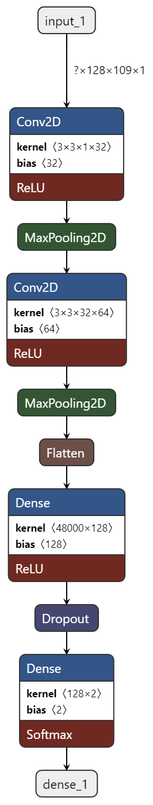
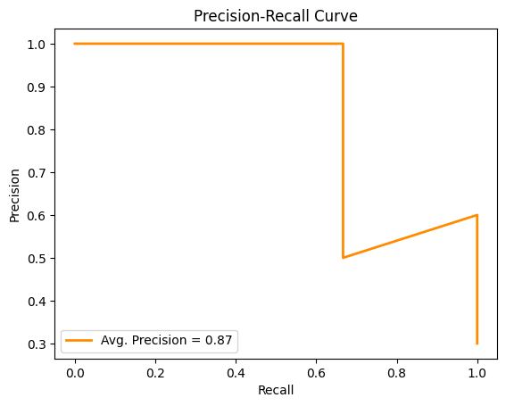
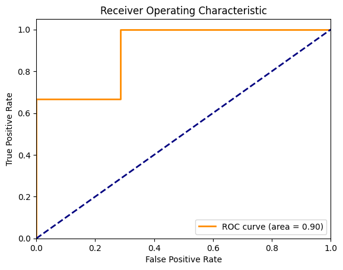

# Audio Deepfake Classification

This project focuses on building a deep learning model for classifying audio files as either genuine (bonafide) or manipulated (spoof). The objective is to detect audio deepfakes, which are manipulated audio recordings designed to impersonate a genuine audio source. The ASVspoof 2019 dataset is used for training and evaluating the model.

## Project Overview

- **Data:** ASVspoof 2019 dataset containing genuine and spoof audio recordings.
- **Preprocessing:** Convert audio files to Mel spectrograms, augment training data.
- **Model Architecture:** Convolutional Neural Network (CNN) with classification layers.
- **Training:** Binary cross-entropy loss, Adam optimizer, monitoring metrics.
- **Evaluation:** Accuracy, F1 score, ROC curve, AUC.
- **Visualization:** Model architecture visualization using `plot_model` and Netron.

## Model Architecture

The model architecture is designed to extract features from Mel spectrograms and make predictions for audio deepfake classification.

1. **Convolutional Layer:** Extracts local features from the Mel spectrogram using convolutional filters.
2. **MaxPooling Layer:** Performs downsampling to reduce spatial dimensions.
3. **Batch Normalization:** Normalizes activations to stabilize training.
4. **ReLU Activation:** Introduces non-linearity to the model.
5. **Dropout Layer:** Prevents overfitting by deactivating neurons randomly during training.
6. **Global Average Pooling Layer:** Aggregates feature maps for global information.
7. **Dense Layer:** Performs classification with a sigmoid activation function.

  

## Metrics 

